# LightGCN 复现实验

---

## 1. 自问自答

### 1.1 什么是协同过滤？

利用用户与物品（如商品、内容）的历史交互数据（如点击、购买、评分），挖掘用户与用户、物品与物品之间的潜在关联，从而为用户推荐可能感兴趣的物品。它无需依赖物品的内容特征（如商品类别、文本描述）或用户的属性特征（如年龄、性别），仅通过"用户 - 物品"的交互关系即可实现个性化推荐，因此在缺乏额外特征的场景中极具优势。

从实现范式上，协同过滤主要分为两类：

#### 1.1.1 基于内容的 CF（如 User-Based、Item-Based）

直接利用历史交互计算用户/物品相似度，但难以处理大规模数据。

- 基于 ml-latest-small 数据集实现 User-Based CF 算法

**ml-latest-small 数据集介绍：**

ml-latest-small 是 MovieLens 其中的一个小规模版本，适合入门实验和快速原型开发。

- **数据规模：** 用户数 610，物品数 9742，评分数 100836
- **提供内容：** 评分、标签和电影元信息等
- **包含文件：** ratings.csv, movies.csv, tags.csv, links.csv

rating.csv 中的数据内容：userId, movieId, rating, timestamp

<pre>
import os

import pandas as pd
import numpy as np

DATA_PATH = "./datasets/ml-latest-small/ratings.csv"
CACHE_DIR = "./datasets/cache/"

def load_data(data_path):
    """
    加载数据
    data_path: 数据集路径
    return: 用户-物品评分矩阵
    """
    # 数据集缓存地址
    cache_path = os.path.join(CACHE_DIR, "ratings_matrix.cache")

    print("开始加载数据集...")
    if os.path.exists(cache_path):    # 判断是否存在缓存文件
        print("加载缓存中...")
        ratings_matrix = pd.read_pickle(cache_path)
        print("从缓存加载数据集完毕")
    else:
        print("加载新数据中...")
        # 设置要加载的数据字段的类型
        dtype = {"userId": np.int32, "movieId": np.int32, "rating": np.float32}
        # 加载数据，只用前三列数据，分别是用户ID，电影ID，已经用户对电影的对应评分
        ratings = pd.read_csv(data_path, dtype=dtype, usecols=range(3))
        # 透视表，将电影ID转换为列名称，转换成为一个User-Movie的评分矩阵
        ratings_matrix = ratings.pivot_table(index=["userId"], columns=["movieId"], values="rating")
        # 存入缓存文件
        ratings_matrix.to_pickle(cache_path)
        print("数据集加载完毕")
    return  ratings_matrix

def compute_pearson_similarity(ratings_matrix, based="user"):
    """
    计算皮尔逊相关系数
    ratings_matrix: 用户-物品评分矩阵
    based: "user" or "item"
    return: 相似度矩阵
    """
    user_similarity_cache_path = os.path.join(CACHE_DIR, "user_similarity.cache")
    item_similarity_cache_path = os.path.join(CACHE_DIR, "item_similarity.cache")
    # 基于皮尔逊相关系数计算相似度
    # 用户相似度
    if based == "user":
        if os.path.exists(user_similarity_cache_path):
            print("正从缓存加载用户相似度矩阵")
            similarity = pd.read_pickle(user_similarity_cache_path)
        else:
            print("开始计算用户相似度矩阵")
            similarity = ratings_matrix.T.corr()
            similarity.to_pickle(user_similarity_cache_path)

    elif based == "item":
        if os.path.exists(item_similarity_cache_path):
            print("正从缓存加载物品相似度矩阵")
            similarity = pd.read_pickle(item_similarity_cache_path)
        else:
            print("开始计算物品相似度矩阵")
            similarity = ratings_matrix.corr()
            similarity.to_pickle(item_similarity_cache_path)
    else:
        raise Exception("Unhandled 'based' Value: %s"%based)
    print("相似度矩阵计算/加载完毕")
    return similarity

def predict(uid, iid, ratings_matrix, user_similar):
    """
    预测给定用户对给定物品的评分值
    uid: 用户ID
    iid: 物品ID
    ratings_matrix: 用户-物品评分矩阵
    user_similar: 用户两两相似度矩阵
    return: 预测的评分值
    """
    print("开始预测用户<%d>对电影<%d>的评分..."%(uid, iid))
    # 1. 找出uid用户的相似用户
    similar_users = user_similar[uid].drop([uid]).dropna()
    # 相似用户筛选规则：正相关的用户
    similar_users = similar_users.where(similar_users>0).dropna()
    if similar_users.empty is True:
        raise Exception("用户<%d>没有相似的用户" % uid)

    # 2. 从uid用户的近邻相似用户中筛选出对iid物品有评分记录的近邻用户
    ids = set(ratings_matrix[iid].dropna().index)&set(similar_users.index)
    finally_similar_users = similar_users.loc[list(ids)]

    # 3. 结合uid用户与其近邻用户的相似度预测uid用户对iid物品的评分
    sum_up = 0    # 评分预测公式的分子部分的值
    sum_down = 0    # 评分预测公式的分母部分的值
    for sim_uid, similarity in finally_similar_users.items():
        # 近邻用户的评分数据
        sim_user_rated_movies = ratings_matrix.loc[sim_uid].dropna()
        # 近邻用户对iid物品的评分
        sim_user_rating_for_item = sim_user_rated_movies[iid]
        # 计算分子的值
        sum_up += similarity * sim_user_rating_for_item
        # 计算分母的值
        sum_down += similarity

    # 计算预测的评分值并返回
    predict_rating = sum_up/sum_down
    print("预测出用户<%d>对电影<%d>的评分：%0.2f" % (uid, iid, predict_rating))
    return round(predict_rating, 2)

def _predict_all(uid, item_ids, ratings_matrix, user_similar):
    """
    预测全部评分
    uid: 用户id
    item_ids: 要预测的物品id列表
    ratings_matrix: 用户-物品打分矩阵
    user_similar: 用户两两间的相似度
    return: 生成器，逐个返回预测评分
    """
    # 逐个预测
    for iid in item_ids:
        try:
            rating = predict(uid, iid, ratings_matrix, user_similar)
        except Exception as e:
            print(e)
        else:
            yield uid, iid, rating

def predict_all(uid, ratings_matrix, user_similar, filter_rule=None):
    """
    预测全部评分，并可根据条件进行前置过滤
    uid: 用户ID
    ratings_matrix: 用户-物品打分矩阵
    user_similar: 用户两两间的相似度
    filter_rule: 过滤规则，只能是四选一，否则将抛异常："unhot","rated",["unhot","rated"],None
    return: 生成器，逐个返回预测评分
    """

    if not filter_rule:
        item_ids = ratings_matrix.columns
    elif isinstance(filter_rule, str) and filter_rule == "unhot":
        '''过滤非热门电影'''
        # 统计每部电影的评分数
        count = ratings_matrix.count()
        # 过滤出评分数高于10的电影，作为热门电影
        item_ids = count.where(count>10).dropna().index
    elif isinstance(filter_rule, str) and filter_rule == "rated":
        '''过滤用户评分过的电影'''
        # 获取用户对所有电影的评分记录
        user_ratings = ratings_matrix.loc[uid]
        # 评分范围是1-5，小于6的都是评分过的，除此以外的都是没有评分的
        _ = user_ratings<6
        item_ids = _.where(_==False).dropna().index
    elif isinstance(filter_rule, list) and set(filter_rule) == set(["unhot", "rated"]):
        '''过滤非热门和用户已经评分过的电影'''
        count = ratings_matrix.count()
        ids1 = count.where(count > 10).dropna().index

        user_ratings = ratings_matrix.loc[uid]
        _ = user_ratings < 6
        ids2 = _.where(_ == False).dropna().index
        # 取二者交集
        item_ids = set(ids1)&set(ids2)
    else:
        raise Exception("无效的过滤参数")

    yield from _predict_all(uid, item_ids, ratings_matrix, user_similar)

def top_k_rs_result(k):
    """TOP-K推荐结果"""
    ratings_matrix = load_data(DATA_PATH)
    user_similar = compute_pearson_similarity(ratings_matrix, based="user")
    results = predict_all(1, ratings_matrix, user_similar, filter_rule=["unhot", "rated"])
    return sorted(results, key=lambda x: x[2], reverse=True)[:k]

if __name__ == '__main__':
    from pprint import pprint

    result = top_k_rs_result(20)
    pprint(result)
</pre>

- 基于 ml-latest-small 数据集实现 Item-Based CF 算法

<pre>
import os

import pandas as pd
import numpy as np

DATA_PATH = "./datasets/ml-latest-small/ratings.csv"
CACHE_DIR = "./datasets/cache/"

def load_data(data_path):
    """
    加载数据
    data_path: 数据集路径
    return: 用户-物品评分矩阵
    """
    # 数据集缓存地址
    cache_path = os.path.join(CACHE_DIR, "ratings_matrix.cache")

    print("开始加载数据集...")
    if os.path.exists(cache_path):    # 判断是否存在缓存文件
        print("加载缓存中...")
        ratings_matrix = pd.read_pickle(cache_path)
        print("从缓存加载数据集完毕")
    else:
        print("加载新数据中...")
        # 设置要加载的数据字段的类型
        dtype = {"userId": np.int32, "movieId": np.int32, "rating": np.float32}
        # 加载数据，我们只用前三列数据，分别是用户ID，电影ID，已经用户对电影的对应评分
        ratings = pd.read_csv(data_path, dtype=dtype, usecols=range(3))
        # 透视表，将电影ID转换为列名称，转换成为一个User-Movie的评分矩阵
        ratings_matrix = ratings.pivot_table(index=["userId"], columns=["movieId"], values="rating")
        # 存入缓存文件
        ratings_matrix.to_pickle(cache_path)
        print("数据集加载完毕")
    return  ratings_matrix

def compute_pearson_similarity(ratings_matrix, based="user"):
    """
    计算皮尔逊相关系数
    ratings_matrix: 用户-物品评分矩阵
    based: "user" or "item"
    return: 相似度矩阵
    """
    user_similarity_cache_path = os.path.join(CACHE_DIR, "user_similarity.cache")
    item_similarity_cache_path = os.path.join(CACHE_DIR, "item_similarity.cache")
    # 基于皮尔逊相关系数计算相似度
    # 用户相似度
    if based == "user":
        if os.path.exists(user_similarity_cache_path):
            print("正从缓存加载用户相似度矩阵")
            similarity = pd.read_pickle(user_similarity_cache_path)
        else:
            print("开始计算用户相似度矩阵")
            similarity = ratings_matrix.T.corr()
            similarity.to_pickle(user_similarity_cache_path)

    elif based == "item":
        if os.path.exists(item_similarity_cache_path):
            print("正从缓存加载物品相似度矩阵")
            similarity = pd.read_pickle(item_similarity_cache_path)
        else:
            print("开始计算物品相似度矩阵")
            similarity = ratings_matrix.corr()
            similarity.to_pickle(item_similarity_cache_path)
    else:
        raise Exception("Unhandled 'based' Value: %s"%based)
    print("相似度矩阵计算/加载完毕")
    return similarity

def predict(uid, iid, ratings_matrix, item_similar):
    """
    预测给定用户对给定物品的评分值
    uid: 用户ID
    iid: 物品ID
    ratings_matrix: 用户-物品评分矩阵
    item_similar: 物品两两相似度矩阵
    return: 预测的评分值
    """
    print("开始预测用户<%d>对电影<%d>的评分..."%(uid, iid))
    # 1. 找出iid物品的相似物品
    similar_items = item_similar[iid].drop([iid]).dropna()
    # 相似物品筛选规则：正相关的物品
    similar_items = similar_items.where(similar_items>0).dropna()
    if similar_items.empty is True:
        raise Exception("物品<%d>没有相似的物品" %iid)

    # 2. 从iid物品的近邻相似物品中筛选出uid用户评分过的物品
    ids = set(ratings_matrix.loc[uid].dropna().index)&set(similar_items.index)
    finally_similar_items = similar_items.loc[list(ids)]

    # 3. 结合iid物品与其相似物品的相似度和uid用户对其相似物品的评分，预测uid对iid的评分
    sum_up = 0    # 评分预测公式的分子部分的值
    sum_down = 0    # 评分预测公式的分母部分的值
    for sim_iid, similarity in finally_similar_items.items():
        # 近邻物品的评分数据
        sim_item_rated_movies = ratings_matrix[sim_iid].dropna()
        # uid用户对相似物品物品的评分
        sim_item_rating_from_user = sim_item_rated_movies[uid]
        # 计算分子的值
        sum_up += similarity * sim_item_rating_from_user
        # 计算分母的值
        sum_down += similarity

    # 计算预测的评分值并返回
    predict_rating = sum_up/sum_down
    print("预测出用户<%d>对电影<%d>的评分：%0.2f" % (uid, iid, predict_rating))
    return round(predict_rating, 2)

def _predict_all(uid, item_ids, ratings_matrix, user_similar):
    """
    预测全部评分
    uid: 用户id
    item_ids: 要预测的物品id列表
    ratings_matrix: 用户-物品打分矩阵
    user_similar: 用户两两间的相似度
    return: 生成器，逐个返回预测评分
    """
    # 逐个预测
    for iid in item_ids:
        try:
            rating = predict(uid, iid, ratings_matrix, user_similar)
        except Exception as e:
            print(e)
        else:
            yield uid, iid, rating

def predict_all(uid, ratings_matrix, user_similar, filter_rule=None):
    """
    预测全部评分，并可根据条件进行前置过滤
    uid: 用户ID
    ratings_matrix: 用户-物品打分矩阵
    user_similar: 用户两两间的相似度
    filter_rule: 过滤规则，只能是四选一，否则将抛异常："unhot","rated",["unhot","rated"],None
    return: 生成器，逐个返回预测评分
    """

    if not filter_rule:
        item_ids = ratings_matrix.columns
    elif isinstance(filter_rule, str) and filter_rule == "unhot":
        '''过滤非热门电影'''
        # 统计每部电影的评分数
        count = ratings_matrix.count()
        # 过滤出评分数高于10的电影，作为热门电影
        item_ids = count.where(count>10).dropna().index
    elif isinstance(filter_rule, str) and filter_rule == "rated":
        '''过滤用户评分过的电影'''
        # 获取用户对所有电影的评分记录
        user_ratings = ratings_matrix.loc[uid]
        # 评分范围是1-5，小于6的都是评分过的，除此以外的都是没有评分的
        _ = user_ratings<6
        item_ids = _.where(_==False).dropna().index
    elif isinstance(filter_rule, list) and set(filter_rule) == set(["unhot", "rated"]):
        '''过滤非热门和用户已经评分过的电影'''
        count = ratings_matrix.count()
        ids1 = count.where(count > 10).dropna().index

        user_ratings = ratings_matrix.loc[uid]
        _ = user_ratings < 6
        ids2 = _.where(_ == False).dropna().index
        # 取二者交集
        item_ids = set(ids1)&set(ids2)
    else:
        raise Exception("无效的过滤参数")

    yield from _predict_all(uid, item_ids, ratings_matrix, user_similar)

def top_k_rs_result(k):
    """TOP-K推荐结果"""
    ratings_matrix = load_data(DATA_PATH)
    user_similar = compute_pearson_similarity(ratings_matrix, based="item")
    results = predict_all(1, ratings_matrix, user_similar, filter_rule=["unhot", "rated"])
    return sorted(results, key=lambda x: x[2], reverse=True)[:k]

if __name__ == '__main__':
    from pprint import pprint

    result = top_k_rs_result(20)
    pprint(result)
</pre>

#### 基于模型的 CF

通过模型学习用户和物品的低维嵌入（Embedding），将交互预测转化为嵌入的相似度计算，更适合大规模场景 —— LightGCN 即属于此类，且是基于图卷积的进阶模型。

### 1.2 协同过滤在 LightGCN 中是如何体现的？

LightGCN 通过图结构建模用户-物品交互，深化对"协同信号"的捕捉。

#### 1.2.1 输入：用户-物品交互图

LightGCN 首先将这种交互关系构建为二分图：

- 图中的节点分为两类：用户节点（U）和物品节点（I）
- 若用户 u 与物品 i 有交互（如点击、购买），则在 u 和 i 之间建立一条无向边
- 图的邻接矩阵 A 定义为：

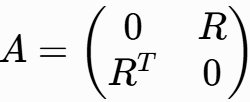

其中 R 是用户-物品交互矩阵。

#### 1.2.2 邻居聚合（LGC）—— 捕捉多阶协同信号

**1 阶协同信号：**

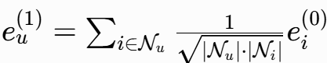

**高阶协同信号：**

2 层嵌入由 1 层物品嵌入的邻居（即与 u 有共同交互物品的其他用户）加权求和得到，对应"用户-用户间接相似性"（如 u 和 v 都喜欢 i，则 u 的嵌入会融入 v 的信息）；更高层（3~4 层）则捕捉更远程的协同关联。

#### 1.2.3 层组合嵌入 —— 融合多阶协同信息

为避免单一层嵌入的"过平滑"，LightGCN 通过层组合将所有层的嵌入加权求和：

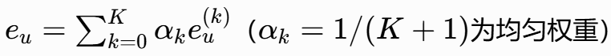

> **注：** 过平滑主要是指在多轮迭代更新过后，节点特征过渡平滑的问题。表现为节点的特征趋向于变得相似，节点之间的差异性减弱。

### 1.3 用户与物品的 Embedding 表示什么意思？

在推荐系统中，用户 Embedding 和物品 Embedding 是指将"高维、稀疏的用户/物品标识或交互信息"转化为"低维、稠密的实数向量"，每个向量的维度代表一个"潜在特征"，整体向量则编码了用户的偏好或物品的属性。主要从 3 个层面理解：

#### 1.3.1 本质：从"稀疏标识"到"稠密特征"的映射

- **原始用户/物品的表示是高维稀疏的：** 例如用户 u 的标识是"1 个 one-hot 向量"（维度 = 用户总数，仅 u 对应的位置为 1，其余为 0），或用户的交互历史是"1 个稀疏向量"（维度 = 物品总数，交互过的物品为 1，其余为 0）
- **Embedding 是低维稠密的：** 例如 LightGCN 中嵌入维度固定为 64，每个维度是连续实数（如 e_u = [0.2, -0.5, 1.1, ..., 0.8]），摆脱了高维稀疏的计算负担

#### 1.3.2 语义：潜在偏好/属性的编码

Embedding 的每个维度没有明确的物理含义，但整体向量对应"潜在特征"：

- **用户 Embedding：** 编码用户的个性化偏好，例如某一维度可能对应"对科幻电影的偏好程度"，另一维度对应"对低价商品的敏感度"
- **物品 Embedding：** 编码物品的潜在属性，例如某一维度可能对应"电影的科幻程度"，另一维度对应"商品的价格区间"

在 LightGCN 中，初始嵌入（0 层）是随机初始化的"潜在特征容器"，通过 LGC 传播后，嵌入会逐渐调整：例如用户 u 交互过"科幻电影"物品 i，u 的嵌入中"科幻偏好"维度会向 i 的"科幻属性"维度靠近，实现"协同偏好编码"。

#### 1.3.3 作用：推荐分数的计算基础

最终的用户/物品嵌入是推荐的"核心凭证"：通过计算两者的内积

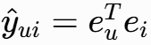

得到推荐分数 —— 内积越大，说明用户的潜在偏好与物品的潜在属性越匹配，推荐优先级越高。例如：用户 u 的 Embedding 中"科幻偏好"维度值为 1.2，物品 i 的"科幻属性"维度值为 0.9，其他维度匹配度一般，内积会因这两个维度的高值而升高，i 会被优先推荐给 u。

### 1.4 什么是 BPR 损失？

#### 1.4.1 BPR 损失定义

BPR 损失是由 Rendle 等人在 2009 年提出的一种针对隐式反馈的 pairwise 排序损失，其核心目标是：让用户"已交互的正样本物品"的推荐分数，严格高于"未交互的负样本物品"的分数，从而优化推荐列表的排序质量，而非预测用户对物品的"绝对评分"。

在推荐系统中，用户很少提供显式反馈（如五星评分），更多是"隐式反馈"（如点击、购买、停留时长）—— 这类反馈仅能说明"用户可能喜欢某物品"（正样本），但无法直接证明"用户不喜欢某物品"（负样本可能是"未曝光"而非"不喜欢"）。BPR 损失通过"对比正、负样本的相对排序"，巧妙解决了隐式反馈的模糊性，精准对齐推荐系统"排序优先"的业务目标。

#### 1.4.2 BPR 在 LightGCN 中的数学形式

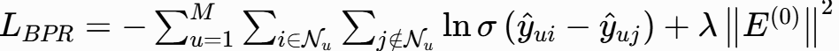

### 1.5 BPR 损失为什么能有效训练模型的推荐效果？

#### 1.5.1 BPR 损失符合推荐系统的目的

推荐系统的业务本质是"将用户可能喜欢的物品排在前面"，而非"预测用户对物品的绝对评分"。例如：用户对物品 A 的预测分数是 3.5、对 B 是 3.0，即使分数都不高，但只要 A 排在 B 前面就是有效推荐；反之，若模型预测 A=4.0、B=4.5，即使分数绝对值高，排序错误也会导致推荐失效。

BPR 损失的设计完全围绕"排序"展开：其目标是让用户已交互的正样本物品（i）的推荐分数，严格高于未交互的负样本物品（j）的分数。

#### 1.5.2 BPR 解决了数据模糊性

推荐系统中，用户极少提供"显式反馈"，更多是"隐式反馈"，比如说点击、购买、停留时长，这类数据存在天然模糊性。BPR 损失解决这种模糊性，无需判断"j 是否为用户真的不喜欢"，只需确保"已交互的 i 比未交互的 j 更优先"。

#### 1.5.3 避免样本不平衡

同样，使用 BPR 能够有效避免"样本不平衡"的问题，如果使用例如 MSE、交叉熵类似的点态损失，就需要将推荐任务转化为"预测用户是否喜欢单个物品"，但隐式反馈中负样本数量远多于正样本，会导致样本严重不平衡：负样本的损失主导训练，模型倾向于"预测所有物品不喜欢"，无法学到有效偏好。

### 1.6 BPR 损失是如何生效的？

1. **采样：** 构建"用户 - 正样本 - 负样本"三元组
2. **计算分数：** 计算用户对正负样本的推荐分数
3. **计算损失：** 根据公式计算 BPR 损失值
4. **反向传播：** 更新嵌入参数（通过"梯度下降"引导 LightGCN 学习合理的嵌入，更新 0 层的初始嵌入）
5. **迭代训练：** 重复上述过程至收敛

---

## 2. 可视化损失以及学习率、Embedding 维度调整

**原始参数：**
- Embedding 维度 = 32
- lr = 0.001
- 层数 = 2

**原始训练结果：**

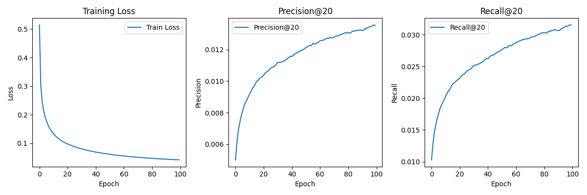

### 2.1 调整学习率

**lr = 0.01**

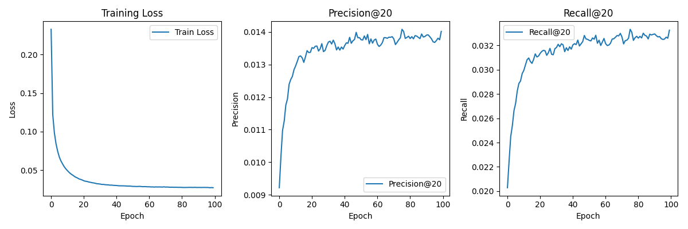

**lr = 0.0001**

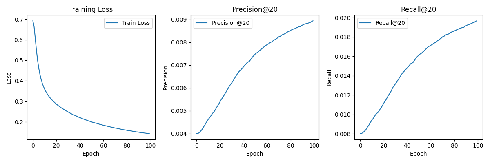

### 2.2 调整 Embedding 维度

**Embedding 维度 = 32**

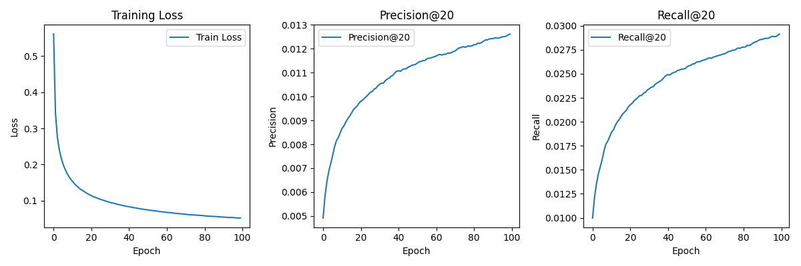

**Embedding 维度 = 128**

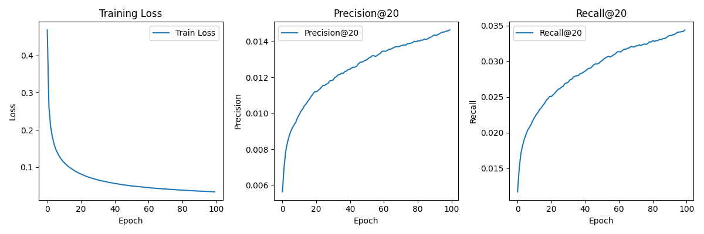

### 2.3 调整层数

**层数 = 1**

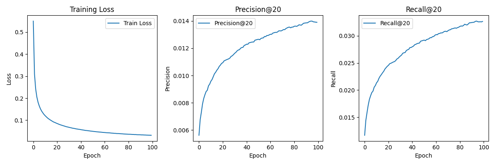

**层数 = 3**

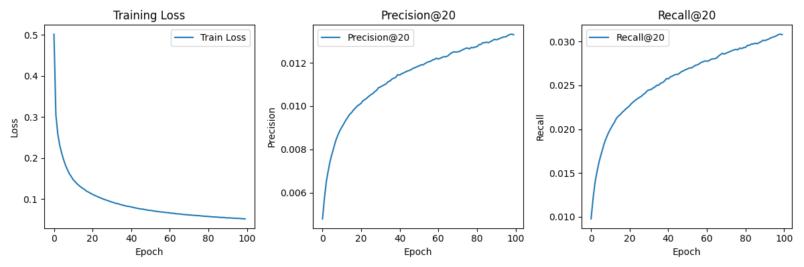

**层数 = 4**

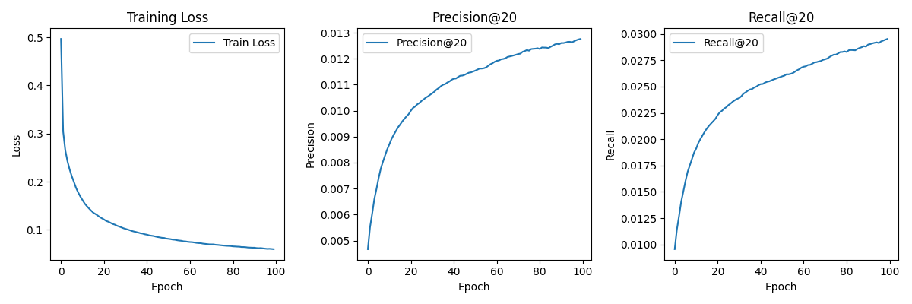

---

## 3. 学习使用 PyTorch 的 nn.Module 类和 PyG 中的 torch_geometric.nn.conv.GCNConv 实现一个简单的卷积网络完成推荐任务

可视化对比 LightGCN 与这个模型之间的损失、指标变化，横坐标为迭代次数。主要流程参考代码 - PyG 中的流程。

### 3.1 数据与图构建

**关键代码片段：**

<pre>
dataset = AmazonBook(path)
data = dataset[0]
num_users, num_books = data['user'].num_nodes, data['book'].num_nodes
data = data.to_homogeneous().to(device)
</pre>

- 原始<code>AmazonBook</code>是异构二分图（user / book）。<code>num_users</code>和<code>num_books</code>在转换前先取出，这是必须的，因为<code>to_homogeneous()</code>会合并 node types 并重新编号节点，用户节点会变成<code>[0, num_users-1]</code>，book 节点从<code>num_users</code>开始。
- <code>to_homogeneous()</code>：把二分图转成单一节点空间。之后，代码里所有基于<code>num_users</code>的切片都依赖这个编号约定。

**筛选正样本：**

<pre>
mask = data.edge_index[0] < data.edge_index[1]
train_edge_label_index = data.edge_index[:, mask]
</pre>

- 在二分图且用户 id 比书 id 小的约定下，选出 user→book 方向的边作为正样本（避免重复计入逆向边）。

### 3.2 模型设计

**GCNRecommender：**

<pre>
self.embedding = nn.Embedding(num_nodes, embedding_dim)
self.conv1 = GCNConv(embedding_dim, hidden_dim)
self.conv2 = GCNConv(hidden_dim, embedding_dim)
</pre>

- 把每个节点（user+book）初始化为可学习的 embedding（<code>nn.Embedding</code>），再用两层<code>GCNConv</code>做图卷积传播 —— 每一层会做线性变换 + 聚合 + 非线性
- 这样模型不仅聚合邻居信息，还会对信息做仿射变换（有权重矩阵），以及非线性变换。

**LightGCN：**

调用<code>torch_geometric.nn.LightGCN</code>

- LightGCN 的核心是只保留邻居信息传播，去掉特征变换（W 矩阵）和非线性（ReLU），并通过对各层聚合结果做加权求和/平均来得到最终 embedding。它强调“只传播协同信号”，因此在推荐场景通常比带变换的 GCN 更有效。
- 通过<code>LightGCN(num_nodes=..., embedding_dim=64, num_layers=2)</code>来替换<code>GCNRecommender</code>，并复用相同训练/评估流程。

### 3.3 训练：采样/损失/流程解释

**Batch 正样本**：<code>train_loader</code>是<code>range(train_edge_label_index.size(1))</code>的 DataLoader，即按正边的列索引做 mini-batch（每个 batch 取若干条正交互）。

**负采样**：

<pre>
neg_edge_label_index = torch.stack([
    pos_edge_label_index[0],
    torch.randint(num_users, num_users + num_books, (index.numel(), ), device=device)
], dim=0)
</pre>

- 对每个正样本 (user, pos_book) 随机采一个负样本 (same user, random_book)；这是典型的 BPR 风格负采样。优点简单高效；缺点可能采到与正例相同的 item 或采到“太容易”的负样本。

**打分**：把所有节点 embedding（通过<code>model.get_embedding(edge_index)</code>）取出，然后用内积（元素乘后求和）作为 score：

<pre>(emb[edge_label_index[0]] * emb[edge_label_index[1]]).sum(dim=-1)</pre>

这是最常用的矩阵分解式评分方法（embedding 的点积）。

**损失**：BPR 损失

<pre>-mean( log( sigmoid( s_pos - s_neg ) ) )</pre>

- 使得正样本得分高于负样本，且 margin 越大越好；用 log-sigmoid 可以稳定训练。

训练中注意事项：

- 每个 batch 都计算一次<code>emb = model.get_embedding(edge_index)</code>，即完整传播并得到节点 embedding，然后基于该 embedding 计算 loss 并做一次反向更新。
- <code>total_loss</code>的累计是以样本数加权的均值计算，最后返回 epoch 平均 loss。

### 3.4 评估——Precision@K / Recall@K 的计算 

**分离 user_emb / book_emb**：

<pre>user_emb, book_emb = emb[:num_users], emb[num_users:]</pre>

**逐批用户计算**：为了不一次性构建<code>num_users x num_books</code>的超大矩阵，按<code>batch_size</code>切分用户（每次构建<code>batch_user x num_books</code>矩阵），节省内存。

**屏蔽（mask）训练边**：把训练集中已经存在的 user-item 对在 logits 中设为<code>-inf</code>，避免它们出现在 top-k 中（评价时只看未见过的推荐）。

**ground-truth**：构建<code>ground_truth</code>矩阵（batch_size x num_books）表示该用户实际在数据中交互过哪些书（用于判断 top-k 是否命中）。

**计算指标**：

- Precision@K = 平均每个用户 top-K 命中数 / K。
- Recall@K = 平均每个用户 top-K 命中数 / 用户真实交互数（用<code>degree</code>计算该用户实际交互数）。

### 3.5 训练结果

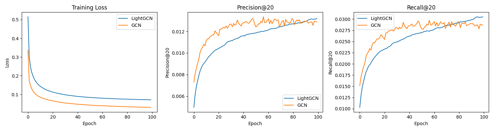

## 4. 数据集换成Movielens，同时训练集：验证集：测试集为8:1:1，可视化训练效果。

### 4.1 Movielens数据集介绍

#### 4.1.1 概述

MovieLens是一个推荐系统和虚拟社区网站，它由美国 Minnesota 大学计算机科学与工程学院的GroupLens项目组创办，是一个非商业性质的、以研究为目的的实验性站点。GroupLens研究组根据MovieLens网站提供的数据制作了MovieLens数据集，这个数据集合里面包含了多个电影评分数据集，分别具有不同的用途。本文均用MovieLens数据集来代替整个集合。MoveieLens数据集可以说是推荐系统领域最为经典的数据集之一。

#### 4.1.2 MovieLens

MoveLens是一个数据集合，其中根据创建时间、数据集大小等分为了若干个子数据集。每个数据集的格式、大小、用途均有所差异。以MovieLens 1M Dataset为例，具体介绍下此数据集，其它MovieLens数据集也大都类似。

**数据集概览**

ml-1m.zip文件解压之后，可以得到4个文件，分别是：

- movies.dat
- ratings.dat
- user.dat
- README

1M数据集有rating.dat、movies.dat、users.data三份数据集。ratings是6040位用户对3900部电影的评分数据（共计1000209）。

**ratings.dat数据文件**

rating.dat文件存放的是用户对电影的评分信息，该文件中每条记录形式：

<pre>UserID::MovieID::Rating::Timestamp</pre>即用户id、电影id、该用户对此电影的评分、时间戳。

**users.dat数据文件**

users.dat文件存放的是用户的相关信息，包括性别、年龄、职业，该文件中每条记录形式：

<pre>UserID::Gender::Age::Occupation::Zip-code</pre>即用户id、性别、年龄、职业、邮政编码。

**movies.dat数据文件**

movies.dat文件存放的是电影的相关信息，该文件中每条记录形式：

<pre>MovieID::Title::Genres </pre>即电影id、电影标题、电影类型。

### 4.2 运行lightgcn_movielens-1m.py

### 4.3 可视化训练结果

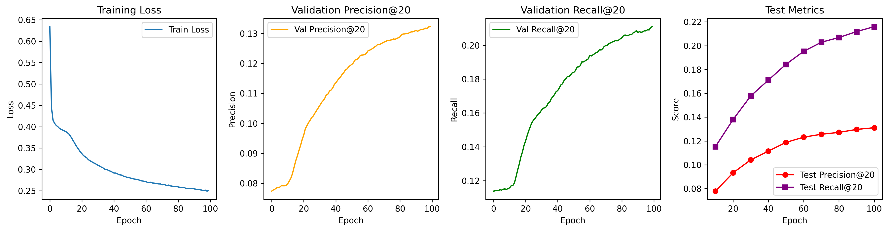

### 4.4 修改GCNvsLightGCN.py数据集,运行GCNvsLightGCN_movielens-1m.py

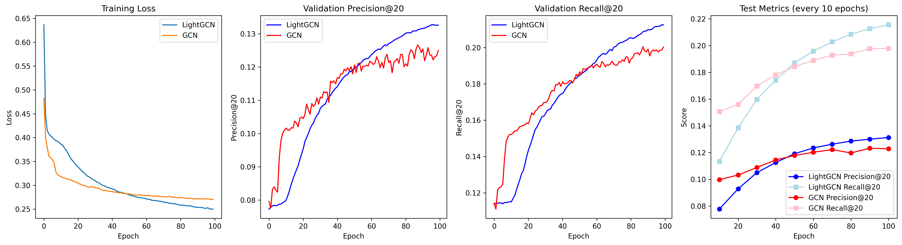

## 5. 寻找其他可以训练推荐系统的损失函数，例如L2范数，对比BPR损失，哪个损失训练效果更好，为什么有些损失函数无法训练高效的推荐模型。

提示：BPR是排名损失，存在正对与负对，但是L2不需要负对，反而需要评分信息。如果觉得训练太慢可以换小一点的数据集。

### 5.1 损失函数为BPR损失

运行lightgcn_movielens-1m.py，得到结果

### 5.2 损失函数为MSE损失

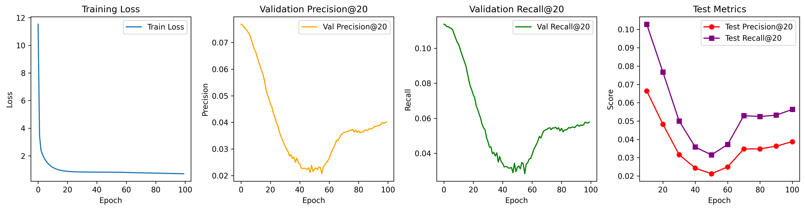

训练损失：模型在拟合评分值上表现良好，训练收敛正常；

验证集/测试集的精确率/召回率：MSE 损失优化的是评分预测误差，而 P@20 是排序指标，两者目标不一致。模型学会了预测评分值，但不一定能让正样本（喜欢的电影）排到前面。后期小幅回升可能是因为嵌入空间逐渐平滑化，使得用户偏好关系有一定恢复。

### 5.2 损失函数为BCE损失

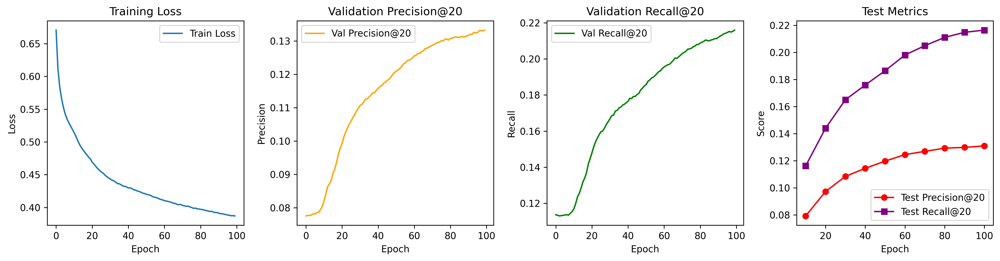

BCE和MSE不同，BCE是去优化“是否喜欢”的概率，而不是像MSE一样去拟合评分数值

## 6. 使用MLP搭建传统双塔推荐模型，然后使用表格记录LGN与该双塔变体模型的实验结果，实验指标请使用Recall@10、Pre@10与NDCG@10

双塔模型（Two-Tower Model）是一种常用于推荐系统和信息检索的神经网络结构，它通过分别为用户和物品构建两套独立的特征编码网络（即“用户塔”和“物品塔”），将二者的特征映射到同一向量空间中，然后通过向量相似度（如点积或余弦相似度）衡量匹配程度。该模型的核心思想是独立学习用户和物品的表示，从而实现高效的相似度计算与大规模召回，常结合BPR或BCE损失进行训练。

**运行MLP_TwoTower.py**

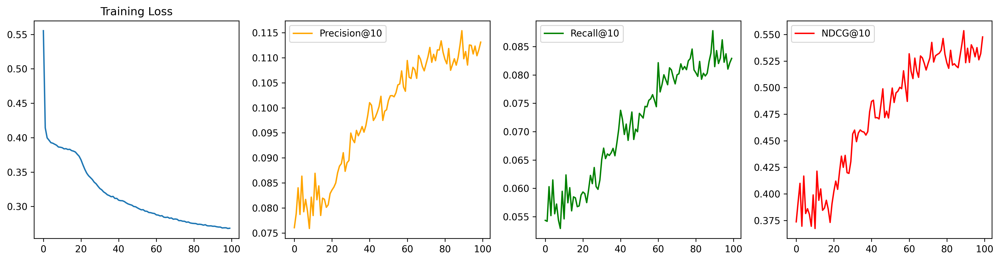

**将MLP和LGN做对比，运行MLPvsLGN_TwoTower.py**

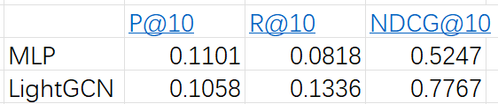

## 7. 传统双塔推荐模型指分别处理用户Embedding和项目Embedding后合并。考虑一种情况，使用LGN处理用户项目数据，作为一个塔，使用用户社交网络作为另一个塔，两塔数据通过聚合层聚合，聚合方法可以是拼接两塔数据再过MLP；可以是通过注意力机制加权聚合

提示：用户社交网络简化为如果两个用户之间有共同的交互项目，则他们之间存在一个连边。

## 8. 实验6中效果与LGN存在一定差距，思考为什么会出现这种差距

提示：考虑LGN的底层原理

## 9. 参考GCN任务中的攻击实验。在Movielens数据集中完成推荐系统中毒与逃逸攻击实验：启发式攻击请使用RandomAttack、AverageAttack、AoPAttack与BandwagonAttack；生成式攻击请使用RAPU。可视化攻击后的模型推荐指标变化

提示：推荐系统中的中毒攻击也叫先令(shilling)攻击，本次实验只考虑用户方面的数据修改，不修改项目数据。

### 9.1 RandomAttack

#### 9.1.1 攻击函数

<pre>def RandomAttack(train_df, num_users, num_movies, num_fake_users, filler_size, rating_value=5.0, target_item=None):
    """
    为每个假用户随机选择 filler_size 个物品并赋固定高评分（rating_value）；
    如果提供 target_item，会保证 target_item 出现在部分假用户的评分中（以增加攻击效果）。
    返回新的 train_df, 新的 num_users（扩展后）·
    """
    fake_rows = []
    start_idx = num_users
    item_pool = list(range(num_movies))
    for fu in range(num_fake_users):
        u_idx = start_idx + fu
        # 随机选取 filler items
        items = random.sample(item_pool, k=min(filler_size, num_movies))
        # 若指定 target_item，确保一部分假用户包含它
        if target_item is not None and fu % 2 == 0 and target_item not in items:
            # 替换第一个元素
            items[0] = target_item
        for it in items:
            fake_rows.append({'user_idx': u_idx, 'movie_idx': int(it), 'rating': rating_value})
    fake_df = pd.DataFrame(fake_rows)
    new_train = pd.concat([train_df, fake_df], ignore_index=True)
    new_num_users = num_users + num_fake_users
    return new_train, new_num_users</pre>

#### 9.1.2 攻击结果

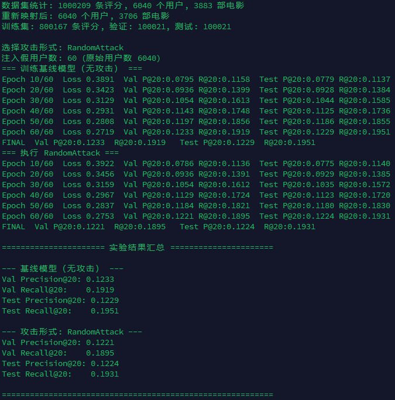

### 9.2 AverageAttack

#### 9.2.1 攻击函数

<pre>def AverageAttack(train_df, num_users, num_movies, num_fake_users, filler_size, rating_value=5.0, target_item=None):
    """
    对每个 item 计算均值评分，假用户对随机选的 items 赋予 item 的均值或调高的均值
    """
    avg_rating = train_df.groupby('movie_idx')['rating'].mean().to_dict()
    fake_rows = []
    start_idx = num_users
    item_pool = list(range(num_movies))
    for fu in range(num_fake_users):
        u_idx = start_idx + fu
        items = random.sample(item_pool, k=min(filler_size, num_movies))
        if target_item is not None and fu % 2 == 0 and target_item not in items:
            items[0] = target_item
        for it in items:
            r = avg_rating.get(it, 3.0)
            # 将均值向上推到 rating_value（但不超过 rating_value）
            r = min(r + 1.0, rating_value)
            fake_rows.append({'user_idx': u_idx, 'movie_idx': int(it), 'rating': r})
    fake_df = pd.DataFrame(fake_rows)
    new_train = pd.concat([train_df, fake_df], ignore_index=True)
    return new_train, num_users + num_fake_users</pre>

#### 9.2.2 攻击结果

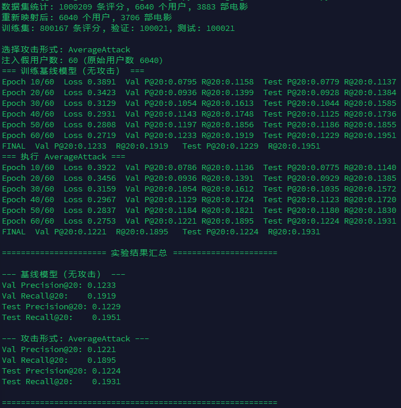

### 9.3 AoPAttack

#### 9.3.1 攻击函数

<pre>def AoPAttack(train_df, num_users, num_movies, num_fake_users, filler_size, rating_value=5.0, target_item=None):
    """
    AoP (Average of Popularity) attack: 假用户优先给流行度高的物品高分（filler选择热门物品）
    """
    pop = train_df['movie_idx'].value_counts().to_dict()
    # 将 items 按流行度排序并取前一部分作为热门池
    popular_items = [int(x) for x, _ in sorted(pop.items(), key=lambda kv: -kv[1])]
    if len(popular_items) == 0:
        popular_items = list(range(num_movies))
    fake_rows = []
    start_idx = num_users
    pop_pool = popular_items[:max(100, int(0.1 * num_movies))]  # 取前 10% 或至少 100
    for fu in range(num_fake_users):
        u_idx = start_idx + fu
        # 选取部分热门物品作为 filler（尽量选热门）
        items = random.sample(pop_pool, k=min(filler_size, len(pop_pool)))
        if target_item is not None and target_item not in items and fu % 2 == 0:
            items[0] = target_item
        for it in items:
            fake_rows.append({'user_idx': u_idx, 'movie_idx': int(it), 'rating': rating_value})
    fake_df = pd.DataFrame(fake_rows)
    new_train = pd.concat([train_df, fake_df], ignore_index=True)

    print(f"[{attack_type}] 注入假用户数: {num_fake_users}, 训练集总数: {len(new_train)}")
    print(new_train.tail(10))

    return new_train, num_users + num_fake_users</pre>

#### 9.3.2 攻击结果

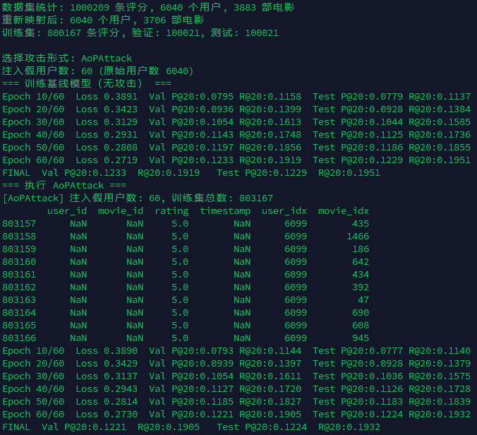

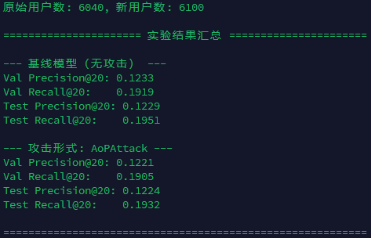