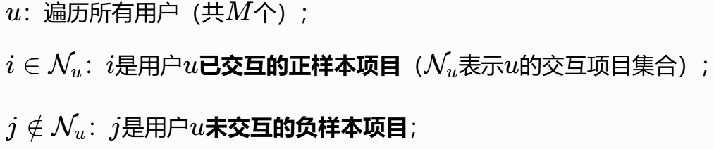

# LightGCN复现实验

---

## 1. 自问自答

### 1.1 什么是协同过滤？
利用用户与物品（如商品、内容）的历史交互数据（如点击、购买、评分），挖掘用户与用户、物品与物品之间的潜在关联，从而为用户推荐可能感兴趣的物品。它无需依赖物品的内容特征（如商品类别、文本描述）或用户的属性特征（如年龄、性别），仅通过 “用户 - 物品” 的交互关系即可实现个性化推荐，因此在缺乏额外特征的场景中极具优势。

从实现范式上，协同过滤主要分为两类：

#### 1.1.1 基于内容的 CF（如用户- based、物品 - based）：

直接利用历史交互计算用户 / 物品相似度，但难以处理大规模数据。

基于ml-latest-small数据集实现User-Based CF算法

ml-latest-small数据集介绍：

ml-latest-small 是MovieLens其中的一个小规模版本，适合入门实验和快速原型开发。

数据规模：用户数 610 物品数 9742 评分数 100836 提供了评分、标签和电影元信息等

包含文件：ratings.csv movies.csv tags.csv links.csv

rating.csv中的数据内容 userId、movieId、rating、timestamp

<pre>
import os

import pandas as pd
import numpy as np

DATA_PATH = "./datasets/ml-latest-small/ratings.csv"
CACHE_DIR = "./datasets/cache/"

def load_data(data_path):
    """
    加载数据
    data_path: 数据集路径
    return: 用户-物品评分矩阵
    """
    # 数据集缓存地址
    cache_path = os.path.join(CACHE_DIR, "ratings_matrix.cache")

    print("开始加载数据集...")
    if os.path.exists(cache_path):    # 判断是否存在缓存文件
        print("加载缓存中...")
        ratings_matrix = pd.read_pickle(cache_path)
        print("从缓存加载数据集完毕")
    else:
        print("加载新数据中...")
        # 设置要加载的数据字段的类型
        dtype = {"userId": np.int32, "movieId": np.int32, "rating": np.float32}
        # 加载数据，只用前三列数据，分别是用户ID，电影ID，已经用户对电影的对应评分
        ratings = pd.read_csv(data_path, dtype=dtype, usecols=range(3))
        # 透视表，将电影ID转换为列名称，转换成为一个User-Movie的评分矩阵
        ratings_matrix = ratings.pivot_table(index=["userId"], columns=["movieId"], values="rating")
        # 存入缓存文件
        ratings_matrix.to_pickle(cache_path)
        print("数据集加载完毕")
    return  ratings_matrix

def compute_pearson_similarity(ratings_matrix, based="user"):
    """
    计算皮尔逊相关系数
    ratings_matrix: 用户-物品评分矩阵
    based: "user" or "item"
    return: 相似度矩阵
    """
    user_similarity_cache_path = os.path.join(CACHE_DIR, "user_similarity.cache")
    item_similarity_cache_path = os.path.join(CACHE_DIR, "item_similarity.cache")
    # 基于皮尔逊相关系数计算相似度
    # 用户相似度
    if based == "user":
        if os.path.exists(user_similarity_cache_path):
            print("正从缓存加载用户相似度矩阵")
            similarity = pd.read_pickle(user_similarity_cache_path)
        else:
            print("开始计算用户相似度矩阵")
            similarity = ratings_matrix.T.corr()
            similarity.to_pickle(user_similarity_cache_path)

    elif based == "item":
        if os.path.exists(item_similarity_cache_path):
            print("正从缓存加载物品相似度矩阵")
            similarity = pd.read_pickle(item_similarity_cache_path)
        else:
            print("开始计算物品相似度矩阵")
            similarity = ratings_matrix.corr()
            similarity.to_pickle(item_similarity_cache_path)
    else:
        raise Exception("Unhandled 'based' Value: %s"%based)
    print("相似度矩阵计算/加载完毕")
    return similarity

def predict(uid, iid, ratings_matrix, user_similar):
    """
    预测给定用户对给定物品的评分值
    uid: 用户ID
    iid: 物品ID
    ratings_matrix: 用户-物品评分矩阵
    user_similar: 用户两两相似度矩阵
    return: 预测的评分值
    """
    print("开始预测用户<%d>对电影<%d>的评分..."%(uid, iid))
    # 1. 找出uid用户的相似用户
    similar_users = user_similar[uid].drop([uid]).dropna()
    # 相似用户筛选规则：正相关的用户
    similar_users = similar_users.where(similar_users>0).dropna()
    if similar_users.empty is True:
        raise Exception("用户<%d>没有相似的用户" % uid)

    # 2. 从uid用户的近邻相似用户中筛选出对iid物品有评分记录的近邻用户
    ids = set(ratings_matrix[iid].dropna().index)&set(similar_users.index)
    finally_similar_users = similar_users.loc[list(ids)]

    # 3. 结合uid用户与其近邻用户的相似度预测uid用户对iid物品的评分
    sum_up = 0    # 评分预测公式的分子部分的值
    sum_down = 0    # 评分预测公式的分母部分的值
    for sim_uid, similarity in finally_similar_users.items():
        # 近邻用户的评分数据
        sim_user_rated_movies = ratings_matrix.loc[sim_uid].dropna()
        # 近邻用户对iid物品的评分
        sim_user_rating_for_item = sim_user_rated_movies[iid]
        # 计算分子的值
        sum_up += similarity * sim_user_rating_for_item
        # 计算分母的值
        sum_down += similarity

    # 计算预测的评分值并返回
    predict_rating = sum_up/sum_down
    print("预测出用户<%d>对电影<%d>的评分：%0.2f" % (uid, iid, predict_rating))
    return round(predict_rating, 2)

def _predict_all(uid, item_ids, ratings_matrix, user_similar):
    """
    预测全部评分
    uid: 用户id
    item_ids: 要预测的物品id列表
    ratings_matrix: 用户-物品打分矩阵
    user_similar: 用户两两间的相似度
    return: 生成器，逐个返回预测评分
    """
    # 逐个预测
    for iid in item_ids:
        try:
            rating = predict(uid, iid, ratings_matrix, user_similar)
        except Exception as e:
            print(e)
        else:
            yield uid, iid, rating

def predict_all(uid, ratings_matrix, user_similar, filter_rule=None):
    """
    预测全部评分，并可根据条件进行前置过滤
    uid: 用户ID
    ratings_matrix: 用户-物品打分矩阵
    user_similar: 用户两两间的相似度
    filter_rule: 过滤规则，只能是四选一，否则将抛异常："unhot","rated",["unhot","rated"],None
    return: 生成器，逐个返回预测评分
    """

    if not filter_rule:
        item_ids = ratings_matrix.columns
    elif isinstance(filter_rule, str) and filter_rule == "unhot":
        '''过滤非热门电影'''
        # 统计每部电影的评分数
        count = ratings_matrix.count()
        # 过滤出评分数高于10的电影，作为热门电影
        item_ids = count.where(count>10).dropna().index
    elif isinstance(filter_rule, str) and filter_rule == "rated":
        '''过滤用户评分过的电影'''
        # 获取用户对所有电影的评分记录
        user_ratings = ratings_matrix.loc[uid]
        # 评分范围是1-5，小于6的都是评分过的，除此以外的都是没有评分的
        _ = user_ratings<6
        item_ids = _.where(_==False).dropna().index
    elif isinstance(filter_rule, list) and set(filter_rule) == set(["unhot", "rated"]):
        '''过滤非热门和用户已经评分过的电影'''
        count = ratings_matrix.count()
        ids1 = count.where(count > 10).dropna().index

        user_ratings = ratings_matrix.loc[uid]
        _ = user_ratings < 6
        ids2 = _.where(_ == False).dropna().index
        # 取二者交集
        item_ids = set(ids1)&set(ids2)
    else:
        raise Exception("无效的过滤参数")

    yield from _predict_all(uid, item_ids, ratings_matrix, user_similar)

def top_k_rs_result(k):
    """TOP-K推荐结果"""
    ratings_matrix = load_data(DATA_PATH)
    user_similar = compute_pearson_similarity(ratings_matrix, based="user")
    results = predict_all(1, ratings_matrix, user_similar, filter_rule=["unhot", "rated"])
    return sorted(results, key=lambda x: x[2], reverse=True)[:k]

if __name__ == '__main__':
    from pprint import pprint

    result = top_k_rs_result(20)
    pprint(result)
</pre>

基于ml-latest-small数据集实现Item-Based CF算法

<pre>
import os

import pandas as pd
import numpy as np

DATA_PATH = "./datasets/ml-latest-small/ratings.csv"
CACHE_DIR = "./datasets/cache/"

def load_data(data_path):
    """
    加载数据
    data_path: 数据集路径
    return: 用户-物品评分矩阵
    """
    # 数据集缓存地址
    cache_path = os.path.join(CACHE_DIR, "ratings_matrix.cache")

    print("开始加载数据集...")
    if os.path.exists(cache_path):    # 判断是否存在缓存文件
        print("加载缓存中...")
        ratings_matrix = pd.read_pickle(cache_path)
        print("从缓存加载数据集完毕")
    else:
        print("加载新数据中...")
        # 设置要加载的数据字段的类型
        dtype = {"userId": np.int32, "movieId": np.int32, "rating": np.float32}
        # 加载数据，我们只用前三列数据，分别是用户ID，电影ID，已经用户对电影的对应评分
        ratings = pd.read_csv(data_path, dtype=dtype, usecols=range(3))
        # 透视表，将电影ID转换为列名称，转换成为一个User-Movie的评分矩阵
        ratings_matrix = ratings.pivot_table(index=["userId"], columns=["movieId"], values="rating")
        # 存入缓存文件
        ratings_matrix.to_pickle(cache_path)
        print("数据集加载完毕")
    return  ratings_matrix

def compute_pearson_similarity(ratings_matrix, based="user"):
    """
    计算皮尔逊相关系数
    ratings_matrix: 用户-物品评分矩阵
    based: "user" or "item"
    return: 相似度矩阵
    """
    user_similarity_cache_path = os.path.join(CACHE_DIR, "user_similarity.cache")
    item_similarity_cache_path = os.path.join(CACHE_DIR, "item_similarity.cache")
    # 基于皮尔逊相关系数计算相似度
    # 用户相似度
    if based == "user":
        if os.path.exists(user_similarity_cache_path):
            print("正从缓存加载用户相似度矩阵")
            similarity = pd.read_pickle(user_similarity_cache_path)
        else:
            print("开始计算用户相似度矩阵")
            similarity = ratings_matrix.T.corr()
            similarity.to_pickle(user_similarity_cache_path)

    elif based == "item":
        if os.path.exists(item_similarity_cache_path):
            print("正从缓存加载物品相似度矩阵")
            similarity = pd.read_pickle(item_similarity_cache_path)
        else:
            print("开始计算物品相似度矩阵")
            similarity = ratings_matrix.corr()
            similarity.to_pickle(item_similarity_cache_path)
    else:
        raise Exception("Unhandled 'based' Value: %s"%based)
    print("相似度矩阵计算/加载完毕")
    return similarity

def predict(uid, iid, ratings_matrix, item_similar):
    """
    预测给定用户对给定物品的评分值
    uid: 用户ID
    iid: 物品ID
    ratings_matrix: 用户-物品评分矩阵
    item_similar: 物品两两相似度矩阵
    return: 预测的评分值
    """
    print("开始预测用户<%d>对电影<%d>的评分..."%(uid, iid))
    # 1. 找出iid物品的相似物品
    similar_items = item_similar[iid].drop([iid]).dropna()
    # 相似物品筛选规则：正相关的物品
    similar_items = similar_items.where(similar_items>0).dropna()
    if similar_items.empty is True:
        raise Exception("物品<%d>没有相似的物品" %iid)

    # 2. 从iid物品的近邻相似物品中筛选出uid用户评分过的物品
    ids = set(ratings_matrix.loc[uid].dropna().index)&set(similar_items.index)
    finally_similar_items = similar_items.loc[list(ids)]

    # 3. 结合iid物品与其相似物品的相似度和uid用户对其相似物品的评分，预测uid对iid的评分
    sum_up = 0    # 评分预测公式的分子部分的值
    sum_down = 0    # 评分预测公式的分母部分的值
    for sim_iid, similarity in finally_similar_items.items():
        # 近邻物品的评分数据
        sim_item_rated_movies = ratings_matrix[sim_iid].dropna()
        # uid用户对相似物品物品的评分
        sim_item_rating_from_user = sim_item_rated_movies[uid]
        # 计算分子的值
        sum_up += similarity * sim_item_rating_from_user
        # 计算分母的值
        sum_down += similarity

    # 计算预测的评分值并返回
    predict_rating = sum_up/sum_down
    print("预测出用户<%d>对电影<%d>的评分：%0.2f" % (uid, iid, predict_rating))
    return round(predict_rating, 2)

def _predict_all(uid, item_ids, ratings_matrix, user_similar):
    """
    预测全部评分
    uid: 用户id
    item_ids: 要预测的物品id列表
    ratings_matrix: 用户-物品打分矩阵
    user_similar: 用户两两间的相似度
    return: 生成器，逐个返回预测评分
    """
    # 逐个预测
    for iid in item_ids:
        try:
            rating = predict(uid, iid, ratings_matrix, user_similar)
        except Exception as e:
            print(e)
        else:
            yield uid, iid, rating

def predict_all(uid, ratings_matrix, user_similar, filter_rule=None):
    """
    预测全部评分，并可根据条件进行前置过滤
    uid: 用户ID
    ratings_matrix: 用户-物品打分矩阵
    user_similar: 用户两两间的相似度
    filter_rule: 过滤规则，只能是四选一，否则将抛异常："unhot","rated",["unhot","rated"],None
    return: 生成器，逐个返回预测评分
    """

    if not filter_rule:
        item_ids = ratings_matrix.columns
    elif isinstance(filter_rule, str) and filter_rule == "unhot":
        '''过滤非热门电影'''
        # 统计每部电影的评分数
        count = ratings_matrix.count()
        # 过滤出评分数高于10的电影，作为热门电影
        item_ids = count.where(count>10).dropna().index
    elif isinstance(filter_rule, str) and filter_rule == "rated":
        '''过滤用户评分过的电影'''
        # 获取用户对所有电影的评分记录
        user_ratings = ratings_matrix.loc[uid]
        # 评分范围是1-5，小于6的都是评分过的，除此以外的都是没有评分的
        _ = user_ratings<6
        item_ids = _.where(_==False).dropna().index
    elif isinstance(filter_rule, list) and set(filter_rule) == set(["unhot", "rated"]):
        '''过滤非热门和用户已经评分过的电影'''
        count = ratings_matrix.count()
        ids1 = count.where(count > 10).dropna().index

        user_ratings = ratings_matrix.loc[uid]
        _ = user_ratings < 6
        ids2 = _.where(_ == False).dropna().index
        # 取二者交集
        item_ids = set(ids1)&set(ids2)
    else:
        raise Exception("无效的过滤参数")

    yield from _predict_all(uid, item_ids, ratings_matrix, user_similar)

def top_k_rs_result(k):
    """TOP-K推荐结果"""
    ratings_matrix = load_data(DATA_PATH)
    user_similar = compute_pearson_similarity(ratings_matrix, based="item")
    results = predict_all(1, ratings_matrix, user_similar, filter_rule=["unhot", "rated"])
    return sorted(results, key=lambda x: x[2], reverse=True)[:k]

if __name__ == '__main__':
    from pprint import pprint

    result = top_k_rs_result(20)
    pprint(result)
</pre>

基于模型的 CF：通过模型学习用户和物品的低维嵌入（Embedding），将交互预测转化为嵌入的相似度计算，更适合大规模场景 ——LightGCN 即属于此类，且是基于图卷积的进阶模型。

### 1.2 协同过滤在LGN中是如何体现的？

LightGCN 通过图结构建模用户 - 物品交互，深化对 “协同信号” 的捕捉。

#### 1.2.1 输入：用户 - 物品交互图

LightGCN 首先将这种交互关系构建为二分图：

图中的节点分为两类：用户节点（U）和物品节点（I）；

若用户 u 与物品 i 有交互（如点击、购买），则在 u 和 i 之间建立一条无向边；

图的邻接矩阵A定义为：

其中R是用户 - 物品交互矩阵。

#### 1.2.2 邻居聚合（LGC）—— 捕捉多阶协同信号

1 阶协同信号：

高阶协同信号：

2 层嵌入由 1 层物品嵌入的邻居（即与 u 有共同交互物品的其他用户）加权求和得到，对应 “用户 - 用户间接相似性”（如 u 和 v 都喜欢 i，则 u 的嵌入会融入 v 的信息）；更高层（3~4 层）则捕捉更远程的协同关联。

#### 1.2.3 层组合嵌入 —— 融合多阶协同信息

为避免单一层嵌入的 “过平滑”，LightGCN 通过层组合将所有层的嵌入加权求和：

Ps：过平滑主要是指在多轮迭代更新过后，节点特征过渡平滑的问题。表现为节点的特征趋向于变得相似，节点之间的差异性减弱。

### 1.3 用户与物品的Embedding表示什么意思？

在推荐系统中，用户 Embedding 和 物品 Embedding 是指将 “高维、稀疏的用户 / 物品标识或交互信息” 转化为 “低维、稠密的实数向量”，每个向量的维度代表一个 “潜在特征”，整体向量则编码了用户的偏好或物品的属性。主要从3个层面理解：

#### 1.3.1 本质：从 “稀疏标识” 到 “稠密特征” 的映射

原始用户 / 物品的表示是高维稀疏的：例如用户 u 的标识是 “1 个 one-hot 向量”（维度 = 用户总数，仅 u 对应的位置为 1，其余为 0），或用户的交互历史是 “1 个稀疏向量”（维度 = 物品总数，交互过的物品为 1，其余为 0）；Embedding 是低维稠密的：例如 LightGCN 中嵌入维度固定为 64，每个维度是连续实数（如(e_u=[0.2, -0.5, 1.1, ..., 0.8])），摆脱了高维稀疏的计算负担。

#### 1.3.2 语义：潜在偏好 / 属性的编码

Embedding 的每个维度没有明确的物理含义，但整体向量对应 “潜在特征”：

用户 Embedding：编码用户的个性化偏好，例如某一维度可能对应 “对科幻电影的偏好程度”，另一维度对应 “对低价商品的敏感度”；

物品 Embedding：编码物品的潜在属性，例如某一维度可能对应 “电影的科幻程度”，另一维度对应 “商品的价格区间”。

在 LightGCN 中，初始嵌入（0 层）是随机初始化的 “潜在特征容器”，通过 LGC 传播后，嵌入会逐渐调整：例如用户 u 交互过 “科幻电影” 物品 i，u 的嵌入中 “科幻偏好” 维度会向 i 的 “科幻属性” 维度靠近，实现 “协同偏好编码”。

#### 1.3.3 作用：推荐分数的计算基础

最终的用户 / 物品嵌入是推荐的 “核心凭证”：通过计算两者的内积

得到推荐分数 —— 内积越大，说明用户的潜在偏好与物品的潜在属性越匹配，推荐优先级越高。例如：用户 u 的 Embedding 中 “科幻偏好” 维度值为 1.2，物品 i 的 “科幻属性” 维度值为 0.9，其他维度匹配度一般，内积会因这两个维度的高值而升高，i 会被优先推荐给 u。

### 1.4 什么是BPR损失？

#### 1.4.1 BPR损失定义

BPR 损失是由 Rendle 等人在 2009 年提出的一种针对隐式反馈的 pairwise 排序损失，其核心目标是：让用户 “已交互的正样本项目” 的推荐分数，严格高于 “未交互的负样本项目” 的分数，从而优化推荐列表的排序质量，而非预测用户对项目的 “绝对评分”。

在推荐系统中，用户很少提供显式反馈（如五星评分），更多是 “隐式反馈”（如点击、购买、停留时长）—— 这类反馈仅能说明 “用户可能喜欢某项目”（正样本），但无法直接证明 “用户不喜欢某项目”（负样本可能是 “未曝光” 而非 “不喜欢”）。BPR 损失通过 “对比正、负样本的相对排序”，巧妙解决了隐式反馈的模糊性，精准对齐推荐系统 “排序优先” 的业务目标。

#### 1.4.2 BPR在LightGCN中的数学形式

### 1.5 BPR损失为什么能有效训练模型的推荐效果？

#### 1.5.1 BPR损失符合推荐系统的目的

推荐系统的业务本质是 “将用户可能喜欢的项目排在前面”，而非 “预测用户对项目的绝对评分”。例如：用户对项目 A 的预测分数是 3.5、对 B 是 3.0，即使分数都不高，但只要 A 排在 B 前面就是有效推荐；反之，若模型预测 A=4.0、B=4.5，即使分数绝对值高，排序错误也会导致推荐失效。

BPR 损失的设计完全围绕 “排序” 展开：其目标是让用户已交互的正样本项目（i）的推荐分数，严格高于未交互的负样本项目（j）的分数。

#### 1.5.2 BPR解决了数据模糊性

推荐系统中，用户极少提供“显式反馈”，更多是“隐式反馈”，比如说点击、购买、停留时长，这类数据存在天然模糊性。BPR损失解决这种模糊性，无需判断 “j 是否为用户真的不喜欢”，只需确保 “已交互的 i 比未交互的 j 更优先”。

#### 1.5.3 避免样本不平衡

同样，使用BPR能够有效避免“样本不平衡”的问题，如果使用例如MSE、交叉熵类似的点态损失，就需要将推荐任务转化为“预测用户是否喜欢单个物品”，但隐式反馈中负样本数量远多于正样本，会导致样本严重不平衡：负样本的损失主导训练，模型倾向于“预测所有项目不喜欢”，无法学到有效偏好。

### 1.6 BPR损失是如何生效的？

先是进行采样，构建“用户 - 正样本 - 负样本”三元组，然后计算用户对正负样本的推荐分数，再根据前面的公式计算BPR损失值，反向传播更新嵌入参数（通过“梯度下降”引导LightGCN学习合理的嵌入，更新0层的初始嵌入），迭代训练至收敛。

---

## 2. 可视化损失以及其他指标

